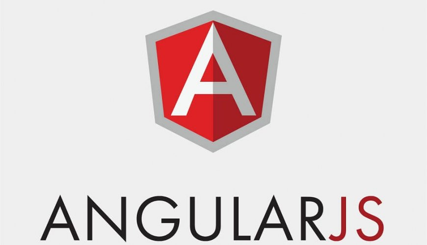

<h1 align="center">
    
</h1>

  <a href="#tecnologias">Tecnologias</a>&nbsp;&nbsp;&nbsp;|&nbsp;&nbsp;&nbsp;
   <a href="#descrição">Descrição</a>&nbsp;&nbsp;&nbsp;|&nbsp;&nbsp;&nbsp;

 
 

## 💻 Tecnologias

Esse código foi desenvolvido com as seguintes tecnologias:

-[C#] 

-[Angula JS]

## ✍ Descrição

Codigo que fiz criando telinha em angularjs
